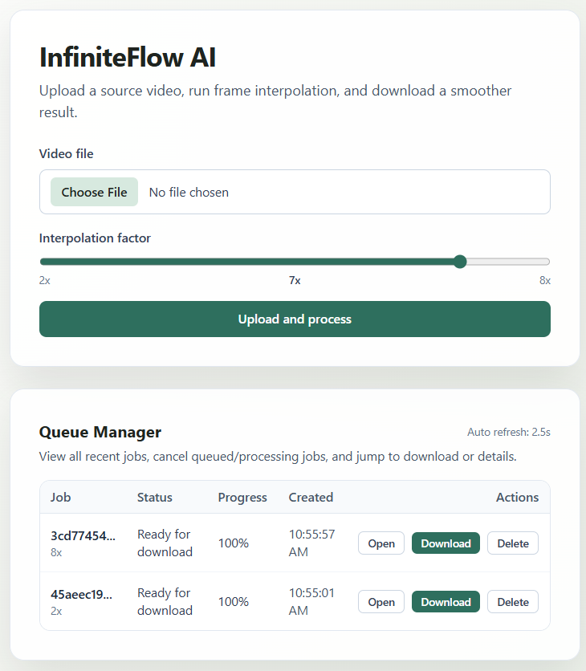

# InfiniteFlow AI - Lightweight Video Interpolation.

Simple, production-ready baseline with low resource usage:

- Backend: FastAPI + SQLAlchemy
- Queue: Redis + RQ
- Database: PostgreSQL
- Worker: OpenCV + FFmpeg (no deep learning models)
- Frontend: Next.js App Router
- Infra: Docker Compose

## Features

- Video upload with interpolation factor control (2x to 8x)
- Background processing with Redis queue (RQ)
- Live job status tracking with progress percentage
- Queue manager table for viewing recent jobs
- Cancel queued and in-progress jobs
- Delete jobs directly from the queue table
- Download processed video when complete
- Local file storage for uploads and outputs
- Lightweight CPU-first processing (OpenCV + FFmpeg)



## Folder Structure

- `frontendcd 'infra'/` - Upload UI and job status pages
- `backend/` - API, persistence, and queueing
- `worker/` - CPU interpolation pipeline
- `infra/` - Compose stack and Dockerfiles

## How It Works

### 1. Upload and Job Creation

1. User uploads a video in the frontend.
2. Backend saves the file to local storage.
3. Backend creates a job row in PostgreSQL.
4. Backend enqueues the job ID in Redis (RQ) and returns immediately.

### 2. Queue Processing

1. Worker reads queued jobs from Redis.
2. Worker loads job metadata from PostgreSQL.
3. Worker extracts frames from the source video.
4. Worker generates intermediate frames (linear blend or optical flow mode).
5. Worker rebuilds video with FFmpeg and preserves audio when available.
6. Worker updates job status/progress in PostgreSQL.

### 3. Job Management and Delivery

1. Frontend reads job state from backend.
2. Queue table allows cancel and delete actions.
3. Finished jobs expose a download endpoint for output files.

## API Overview

- POST /api/v1/jobs
	Creates a new interpolation job from uploaded file.
- GET /api/v1/jobs
	Lists recent jobs for queue management.
- GET /api/v1/jobs/{job_id}
	Returns status, progress, and output readiness.
- POST /api/v1/jobs/{job_id}/cancel
	Requests cancellation for queued/processing jobs.
- DELETE /api/v1/jobs/{job_id}
	Removes job row and related local files.
- GET /api/v1/jobs/{job_id}/download
	Downloads processed output video when ready.


# Quick Start

## From the project root:

```
cd 'infra'
```
then
```
docker compose up --build
```
# or a one-liner build:
```bash
docker compose -f infra/docker-compose.yml up --build
```

Endpoints:

- Frontend: http://localhost:3000
- API docs: http://localhost:8000/docs
- Health: http://localhost/api/v1/health

## Environment Defaults

- Postgres DB: `interp`
- Postgres user: `app`
- Postgres password: `app`
- Redis queue: `video`
- Shared file volume mounted at: `/data`

## Why This Is Lightweight and efficient

- No GPU dependency
- No model loading or inference overhead
- Frame blending interpolation keeps memory predictable
- Redis + RQ is simpler and cheaper to operate than larger distributed task stacks
